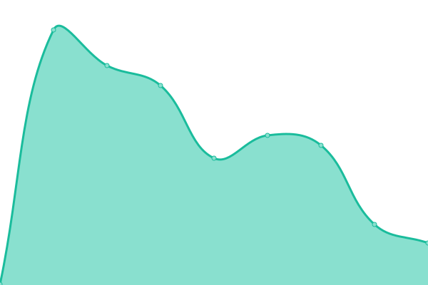
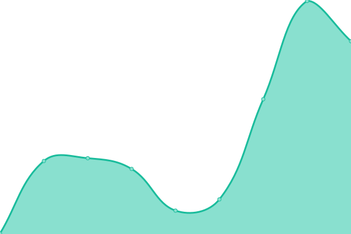

# [📈 Live Status](https://woodcoin-core.github.io/upptime): <!--live status--> **🟩 All systems operational**

This repository contains the open-source uptime monitor and status page for [Woodcoin](https://woodcoin.org), powered by [Upptime](https://github.com/upptime/upptime).

We use [Issues](https://github.com/woodcoin-core/upptime/issues) as incident reports, [Actions](https://github.com/woodcoin-core/upptime/actions) as uptime monitors, and [Pages](https://woodcoin-core.github.io/upptime) for the status page.

<!--start: status pages-->
<!-- This summary is generated by Upptime (https://github.com/upptime/upptime) -->
<!-- Do not edit this manually, your changes will be overwritten -->
<!-- prettier-ignore -->
| URL | Status | History | Response Time | Uptime |
| --- | ------ | ------- | ------------- | ------ |
|  [Woodcoin Explorer](https://explorer.woodcoin.org/chain/Woodcoin) | 🟩 Up | [woodcoin-explorer.yml](https://github.com/woodcoin-core/upptime/commits/HEAD/history/woodcoin-explorer.yml) | 

 131ms
     
 | 

<a href="https://status.woodcoin.org/history/woodcoin-explorer">99.79%</a>
    

|  [Woodcoin Site](https://woodcoin.org) | 🟩 Up | [woodcoin-site.yml](https://github.com/woodcoin-core/upptime/commits/HEAD/history/woodcoin-site.yml) | 

 236ms
     
 | 

<a href="https://status.woodcoin.org/history/woodcoin-site">100.00%</a>
    

|  [Woodcoin New Explorer](https://new.explorer.woodcoin.org) | 🟩 Up | [woodcoin-new-explorer.yml](https://github.com/woodcoin-core/upptime/commits/HEAD/history/woodcoin-new-explorer.yml) | 

 368ms
     
 | 

<a href="https://status.woodcoin.org/history/woodcoin-new-explorer">100.00%</a>
    

<!--end: status pages-->

[**Visit our status website →**](https://woodcoin-core.github.io/upptime)

## 📄 License

- Powered by: [Upptime](https://github.com/upptime/upptime)
- Code: [MIT](./LICENSE) © [Woodcoin](https://woodcoin.org)
- Data in the `./history` directory: [Open Database License](https://opendatacommons.org/licenses/odbl/1-0/)
